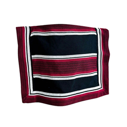

# Poncho



## Description
Creador de componentes Angular


## Installation
```bash
git clone https://github.com/your-username/your-repo.git
```

After that you can add the folder to variable environments depending on your OS.

```go
go build
```

